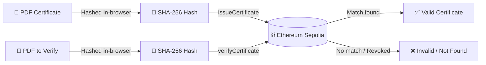
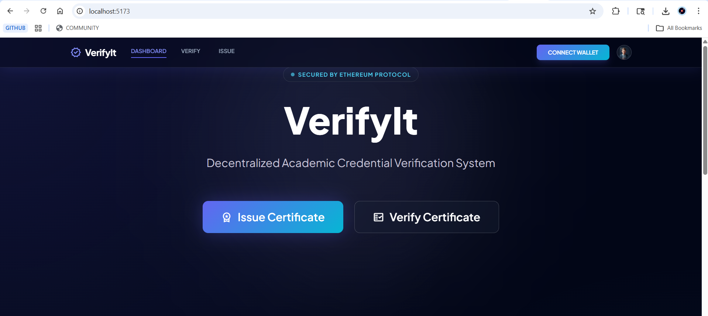
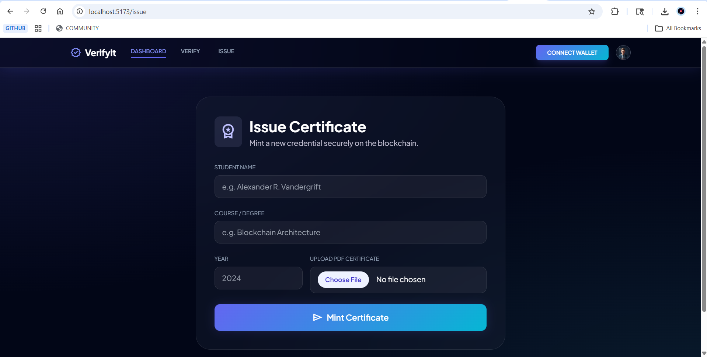
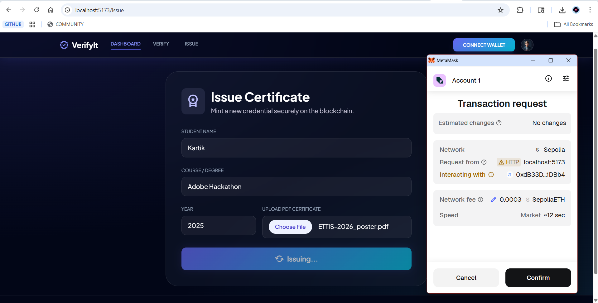
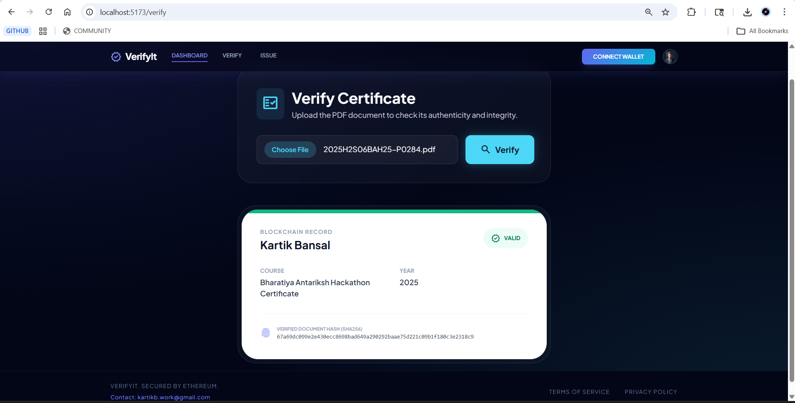

<div align="center">

<br/>

# 🛡️ VerifyIt

### Decentralized Academic Credential Verification, Secured by Ethereum

**Issue tamper-proof certificates. Verify them instantly. Trust the chain, not the paper.**

<br/>

[](https://soliditylang.org/)
[](https://react.dev/)
[](https://vitejs.dev/)
[](https://docs.ethers.org/)
[](https://sepolia.dev/)

<br/>

[Overview](#-overview) • [How It Works](#-how-it-works) • [Screenshots](#-screenshots) • [Tech Stack](#-tech-stack) • [Getting Started](#-getting-started) • [Smart Contract](#-smart-contract) • [Project Structure](#-project-structure) • [Deployment](#-deployment)

</div>

---

## 📖 Overview

**VerifyIt** is a blockchain-powered platform that lets institutions issue academic certificates and lets *anyone* verify their authenticity in seconds — without ever exposing the actual document to a third party.

Instead of storing certificate files anywhere, VerifyIt generates a unique **SHA-256 fingerprint** of the PDF directly in the browser and anchors that fingerprint to the **Ethereum Sepolia testnet**. Because blockchain records can't be silently edited, a certificate is either an exact, byte-for-byte match to what was issued — or it isn't. There's no in-between, no "trust us," and no central database that can be hacked, lost, or quietly altered.

> 🔒 **Privacy-first by design** — the actual PDF never leaves the user's browser or touches a server. Only its cryptographic hash is ever transmitted or stored.

<br/>

<table>
<tr>
<td width="50%" valign="top">

### 🎓 For Institutions
- Issue certificates directly on-chain
- Revoke certificates issued in error
- No paperwork, no intermediaries
- Admin-gated smart contract functions

</td>
<td width="50%" valign="top">

### ✅ For Verifiers
- Upload any PDF to check authenticity
- Instant, trustless validation
- See student name, course & year on-chain
- Works from anywhere, anytime

</td>
</tr>
</table>

---

## ⚙️ How It Works

<div align="center">



</div>

1. **Issue** — An admin uploads a certificate PDF. The app hashes it locally and calls `issueCertificate()`, storing the student's name, course, year, and hash on-chain.
2. **Share** — The institution hands the physical/digital PDF to the student. Nothing else needs to be shared.
3. **Verify** — Anyone with the PDF can upload it to VerifyIt. The app re-computes the hash and calls `verifyCertificate()` to check the ledger.
4. **Result** — If the hash matches an active record, the certificate details are displayed instantly with a **Valid** badge. If the file was altered in any way — even a single pixel — the hash won't match, and verification fails.
5. **Revoke** — If a certificate was issued in error, the admin can call `revokeCertificate()` to flip its status without deleting the historical record.

---

## 🖼️ Screenshots

<div align="center">


<p align="center">
  
</p>

<p align="center">
  
</p>

<p align="center">
  
</p>

<p align="center">
  
</p>


---

## 🧠 Tech Stack

<div align="center">

| Layer | Technology |
|---|---|
| **Smart Contract** | Solidity `^0.8.20`, Hardhat, Hardhat Toolbox |
| **Blockchain Interaction** | Ethers.js v6 |
| **Frontend** | React 19, Vite, React Router |
| **Styling** | Tailwind CSS |
| **Hashing** | Crypto-JS (SHA-256, client-side) |
| **Icons** | Lucide React |
| **Network** | Ethereum Sepolia Testnet |

</div>

<details>
<summary><b>📦 Full dependency list</b></summary>

<br/>

**Root (`/`)**
```json
"devDependencies": {
  "@nomicfoundation/hardhat-toolbox": "^5.0.0",
  "hardhat": "^2.28.6"
},
"dependencies": {
  "dotenv": "^17.4.2"
}
```

**Client (`/client`)**
```json
"dependencies": {
  "crypto-js": "^4.2.0",
  "ethers": "^6.16.0",
  "lucide-react": "^1.14.0",
  "react": "^19.2.5",
  "react-dom": "^19.2.5",
  "react-router-dom": "^7.14.2"
}
```

</details>

---

## 🚀 Getting Started

### Prerequisites
- **Node.js** (v18 or higher recommended)
- **MetaMask** (or any injected Ethereum wallet) connected to the **Sepolia** testnet
- Sepolia test ETH (available from any public faucet) if you intend to deploy your own contract

### 1. Clone the repository
```bash
git clone https://github.com/kartikbansalx/VerifyIt.git
cd VerifyIt
```

### 2. Install dependencies

<table>
<tr>
<td>

**Smart contract / Hardhat**
```bash
npm install
```

</td>
<td>

**Frontend client**
```bash
cd client
npm install
```

</td>
</tr>
</table>

### 3. Run the frontend locally
```bash
cd client
npm run dev
```
The app will be available at `http://localhost:5173`.

### 4. (Optional) Deploy your own smart contract
Create a `.env` file in the project root with:
```env
SEPOLIA_RPC_URL=your_sepolia_rpc_url
PRIVATE_KEY=your_wallet_private_key
```
Then deploy:
```bash
npx hardhat run scripts/deploy.js --network sepolia
```
After deploying, update the contract address in `client/src/utils/contract.js` to point the frontend at your new contract.

> ⚠️ **Note**: The deployed demo already points to a contract permanently deployed on Sepolia — you only need to redeploy if you want your own independent instance.

---

## 📜 Smart Contract

The core logic lives in [`contracts/Certificate.sol`](contracts/Certificate.sol) — a minimal, gas-conscious contract with three functions:

<details>
<summary><b>🔎 View contract interface</b></summary>

<br/>

```solidity
function issueCertificate(
    string memory _name,
    string memory _course,
    uint _year,
    string memory _hash
) public onlyAdmin;

function verifyCertificate(string memory _hash) public view returns (Cert memory);

function revokeCertificate(string memory _hash) public onlyAdmin;
```

| Function | Access | Description |
|---|---|---|
| `issueCertificate` | Admin only | Stores a new certificate record keyed by its document hash |
| `verifyCertificate` | Public | Returns certificate details for a given hash (read-only) |
| `revokeCertificate` | Admin only | Marks an existing certificate as invalid without deleting it |

</details>

---

## 📁 Project Structure

```
VerifyIt/
├── contracts/
│   └── Certificate.sol        # Core Solidity smart contract
├── scripts/
│   └── deploy.js              # Hardhat deployment script
├── client/                    # React + Vite frontend
│   └── src/
│       ├── components/        # Navbar, Hero, Features, HowItWorks, CertificatePreview
│       ├── pages/              # Home, Issue, Verify
│       └── utils/
│           └── contract.js    # Ethers.js contract binding
├── hardhat.config.js
└── package.json
```

---

## ☁️ Deployment

This project is a monorepo — the frontend lives inside `client/`, not the repo root — so a couple of settings matter when deploying to **Vercel**:

1. Push the repository to GitHub.
2. Import the project into your [Vercel Dashboard](https://vercel.com/dashboard).
3. Set the **Root Directory** to `client`.
4. Framework preset will auto-detect as **Vite** — no environment variables are required for the frontend build.
5. Deploy 🚀 — Vercel will give you a live URL.

The smart contract itself is already deployed on Sepolia and wired into the frontend via `client/src/utils/contract.js`, so no additional backend or contract deployment is needed just to run the UI.

---

<div align="center">

### 🌐 Built by [Kartik Bansal](https://github.com/kartikbansalx)

<sub>If this project helped you, consider giving it a ⭐ — it genuinely helps!</sub>

</div>
